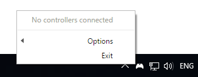
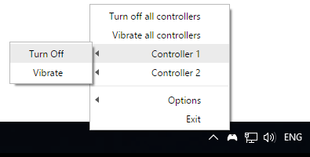

<h1 align="center">
   
  
   
  xbox-ctrl-tray
   
   
</h1>

<h4 align="center">Tray application to control xbox controllers</h4>

## Install

Download the latest version of xbox-ctrl-tray from the
[GitHub releases](https://github.com/noamokman/xbox-ctrl-tray/releases) page.

## Screenshots

  
  

## Features

* See connected xbox controllers
* Vibrate any/all controllers
* Turn off any/all controllers

## [xbox-ctrl](https://github.com/noamokman/xbox-ctrl)

The underlying native module that controls the controllers.
This project is an electron app that wraps the native module.
Added functionallity should start from there.

## Windows Only?
The [xbox-ctrl](https://github.com/noamokman/xbox-ctrl) module only works on windows at the moment.

## License

[MIT](LICENSE)
